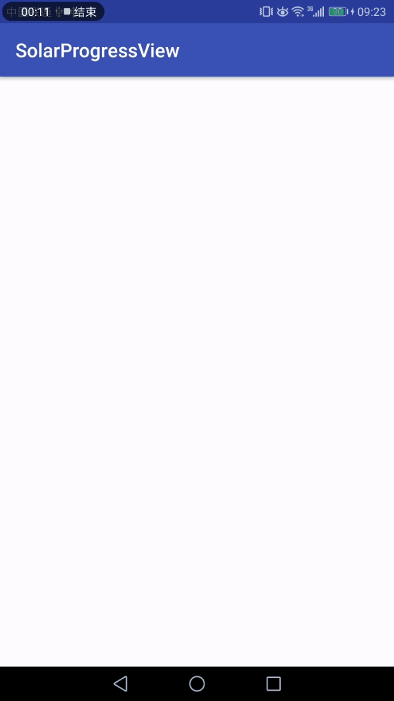

# SolarProgressView
类似于太阳花形状的自定义进度条



### 使用

    <com.mqt.solarprogressview.SolarView
        android:id="@+id/sv_light"
        android:layout_width="120dp"
        android:layout_height="120dp"
        app:color="@color/colorAccent"
        app:lightRadius="6dp"
        app:max="8"
        app:pregress="0"
        app:solarScale="0.26" />
### 自定义属性
 > color：控件颜色
> 
   > lightRadius：四周小圆的半径
   > 
   > max：进度最大值
   > 
   > pregress：当前进度值
   > 
   > solarScale：中间“太阳”占整个控件的百分比0-1

---

## 实现思路：
①光线强度数据的获取：Android光线传感器  
②光线强度的UI展示：自定义SolarProgressView  
③光线数据源 --> UI展示需要数据的转化: 数据梯度设置  
④其他动画效果的实现:光线强度增加的过度动画  
### 光线强度数据的获取：Android光线传感器

Android光线传感器是Android获取周围环境光的感光器元件，通过注册感光器的传感器监听，我们就可以通过传感器传过来的数值。

获得光线传感器实例：
```Java
manager = (SensorManager) getSystemService(SENSOR_SERVICE);
sensor = manager.getDefaultSensor(Sensor.TYPE_LIGHT);
```
注册监听器开始监听传感器数据
```java
 private SensorEventListener listener = new SensorEventListener() {
        @Override
        public void onSensorChanged(SensorEvent event) {       
			            //取得数据
            Log.i("sensor_Data","\naccuracy : " + event.accuracy
            + "\ntimestamp : " + event.timestamp
            + "\nvalues : " + Arrays.toString(event.values));
        }

        @Override
        public void onAccuracyChanged(Sensor sensor, int accuracy) {

        }
    };
@Override
protected void onResume() {
    super.onResume();
    manager.registerListener(listener, sensor, SensorManager.SENSOR_DELAY_NORMAL);
}
```
在合适的时机取消注册，节省资源占用：
```java
@Override
protected void onPause() {
    super.onPause();
    manager.unregisterListener(listener);
}
```

### 光线强度的UI展示：自定义SolarProgressView  
在用来展示的数据都准备好了之后，我们就要考虑如何将这些被整理好的数据展示出来了，实际上我们使用一个ProgressBar来展示即可，但考虑到展示的美观性和光线强弱变化的动画交互，我们决定自定义一个类似于太阳花的自定义控件来展示数据。并且这个自定义控件具有同ProgressBar类似的属性，比如max（最大值）、progress（当前值）等等。  
有了明确的想法之后，开始开发：
```java
package com.mqt.solarprogressview;

import android.animation.Animator;
import android.animation.ObjectAnimator;
import android.animation.ValueAnimator;
import android.content.Context;
import android.content.res.TypedArray;
import android.graphics.Canvas;
import android.graphics.Color;
import android.graphics.Paint;
import android.support.annotation.ColorInt;
import android.support.annotation.FloatRange;
import android.support.annotation.IntRange;
import android.util.AttributeSet;
import android.view.View;
import android.view.animation.AnimationSet;
import android.view.animation.DecelerateInterpolator;


public class SolarView extends View {

    private int mColor = Color.RED;
    private int mMax = 9;
    private int mPregress = 0;

    private float mLolarScale;
    private int mLightRadius;
    private ObjectAnimator mScaleAnim;
    private int mLightRadiusAnim;
    private ObjectAnimator mColorAnim;

    public SolarView(Context context) {
        super(context);
        init(null, 0);
    }

    public SolarView(Context context, AttributeSet attrs) {
        super(context, attrs);
        init(attrs, 0);
    }

    public SolarView(Context context, AttributeSet attrs, int defStyle) {
        super(context, attrs, defStyle);
        init(attrs, defStyle);
    }

    private void init(AttributeSet attrs, int defStyle) {
        // Load attributes
        final TypedArray a = getContext().obtainStyledAttributes(
                attrs, R.styleable.SolarView, defStyle, 0);

        mColor = a.getColor(R.styleable.SolarView_color, Color.RED);
        mMax = a.getInt(R.styleable.SolarView_max, 9);
        mPregress = a.getInt(R.styleable.SolarView_pregress, 0);
        mLolarScale = a.getFloat(R.styleable.SolarView_solarScale, 0.25F);
        mLightRadius = a.getDimensionPixelSize(R.styleable.SolarView_lightRadius, 10);
        mLightRadiusAnim = mLightRadius;
        a.recycle();
        initPaint();
        initAnim();
    }

    private void initAnim() {
        mScaleAnim = ObjectAnimator
                .ofInt(this, "mLightRadiusAnim", mLightRadius / 2, mLightRadius, mLightRadius * 2, mLightRadius);
        mScaleAnim.setDuration(1200);//设置动画时间
        mScaleAnim.setInterpolator(new DecelerateInterpolator());//设置动画插入器，减速
        mScaleAnim.setRepeatCount(0);//设置动画重复次数，这里-1代表无限
        mScaleAnim.addUpdateListener(new ValueAnimator.AnimatorUpdateListener() {
            @Override
            public void onAnimationUpdate(ValueAnimator animation) {
                int value = (int) animation.getAnimatedValue();
                mLightRadiusAnim = value;
                postInvalidate();
            }
        });

        mColorAnim = ObjectAnimator
                .ofArgb(this, "mColor", mColor, Color.rgb(250, 128, 10), mColor);
        mColorAnim.setDuration(1200);//设置动画时间
        mColorAnim.setInterpolator(new DecelerateInterpolator());//设置动画插入器，减速
        mColorAnim.setRepeatCount(0);//设置动画重复次数，这里-1代表无限
        mColorAnim.addUpdateListener(new ValueAnimator.AnimatorUpdateListener() {
            @Override
            public void onAnimationUpdate(ValueAnimator animation) {
                int value = (int) animation.getAnimatedValue();
                mColor = value;
                postInvalidate();
            }
        });
    }

    private int radumColor() {
        return Color.rgb((int) (Math.random() * 255), (int) (Math.random() * 255), (int) (Math.random() * 255));
    }

    Paint mPaint;

    private void initPaint() {
        mPaint = new Paint();
        mPaint.setColor(mColor);
        mPaint.setAntiAlias(true);
        mPaint.setStyle(Paint.Style.FILL);
    }

    @Override
    protected void onDraw(Canvas canvas) {
        super.onDraw(canvas);
        //实心圆，直径为控件的最小宽高的一半
        int min = Math.min(getWidth(), getHeight());
        float r = min * mLolarScale;
        mPaint.setColor(mColor);
        canvas.drawCircle(getWidth() / 2, getHeight() / 2, r, mPaint);
        for (int i = 0; i < mMax && i < mPregress; i++) {
            canvas.save();
            canvas.rotate((360f / mMax) * i, getWidth() >> 1, getHeight() >> 1);
            if (i == mPregress - 1) {
                canvas.drawCircle(getWidth() >> 1, getHeight() >> 3, mLightRadiusAnim, mPaint);
            } else {
                canvas.drawCircle(getWidth() >> 1, getHeight() >> 3, mLightRadius, mPaint);
            }
            canvas.restore();
        }
    }

    @Override
    protected void onMeasure(int widthMeasureSpec, int heightMeasureSpec) {
        super.onMeasure(widthMeasureSpec, heightMeasureSpec);
        int minw = getPaddingLeft() + getPaddingRight() + getSuggestedMinimumWidth();
        int w = resolveSizeAndState(minw, widthMeasureSpec, 0);
        int minh = getPaddingLeft() + getPaddingRight() + getSuggestedMinimumWidth();
        int h = resolveSizeAndState(minh, heightMeasureSpec, 0);
        setMeasuredDimension(w, h);
    }

    @Override
    protected void onSizeChanged(int w, int h, int oldw, int oldh) {
        super.onSizeChanged(w, h, oldw, oldh);
    }

    public int getColor() {
        return mColor;
    }

    public void setColor(@ColorInt int color) {
        this.mColor = color;
        postInvalidate();
    }

    public int getMax() {
        return mMax;
    }

    public void setMax(@IntRange(from = 0) int max) {
        this.mMax = max;
        postInvalidate();
    }

    public int getPregress() {
        return mPregress;
    }

    public void setPregress(@IntRange(from = 0) int pregress) {
        if (pregress > this.mPregress) {
            mColorAnim.cancel();
            mColorAnim.start();
            mScaleAnim.cancel();
            mScaleAnim.start();//启动动画
        }
        this.mPregress = pregress;

    }

    public float getLolarScale() {
        return mLolarScale;
    }

    public void setLolarScale(@FloatRange(from = 0, to = 1) float lolarScale) {
        this.mLolarScale = lolarScale;
        postInvalidate();
    }

    public int getLightRadius() {
        return mLightRadius;
    }

    public void setLightRadius(@IntRange(from = 0) int lightRadius) {
        this.mLightRadius = lightRadius;
        postInvalidate();
    }
}
```
自定义属性XML：
```XML
<resources>
    <declare-styleable name="SolarView">
        <attr name="max" format="integer" />
        <attr name="pregress" format="integer" />
        <attr name="color" format="color" />
        <attr name="solarScale" format="float" />
        <attr name="lightRadius" format="dimension" />
    </declare-styleable>
</resources>
```

### 光线数据源 --> UI展示需要数据的转化: 数据梯度设置
在我们获取到传感器给出的光照强度数据源后，我们无法直接使用，因为光线给出的数据与UI展示需要的数据不同，因此我们需要下转化，直接在传感器监听中添加代码即可：
```java
private SensorEventListener listener = new SensorEventListener() {
        @Override
        public void onSensorChanged(SensorEvent event) {
            float intensity = event.values[2];
            int size = (int) ((intensity * sv_light.getMax() / 120));
            sv_light.setPregress(size);
            textView.setText(
                    "\naccuracy : " + event.accuracy
                            + "\ntimestamp : " + event.timestamp
                            + "\nvalues : " + Arrays.toString(event.values)
            );
        }

        @Override
        public void onAccuracyChanged(Sensor sensor, int accuracy) {

        }
    };
```
### 其他动画效果的实现:光线强度增加的过度动画  
光线传感器数据获取完成了，用于UI展示的自定义控件也写好了，数据也匹配好了可以正常展示了，但我们可能还不会满足，我们可能还希望给这个自定义控件在传感器数据发生变化的时候，有一个动画出来。这个动画其实在上面粘贴的代码中已经有了，这里只是介绍一下给这个自定义view添加动画的思路：
我们知道自定义view的所有的视图都是在onDraw(Canvas canvas)方法中用Canvas画出来的，而化成什么样子又是其中的各种参数控制的，例如我们在自定义控件中画一个圆，我们只需要动态的改变这个圆的半径，就能达到这个圆的放大缩小的目的，当我们有规律的并且足够频繁改变这个值，就可以达到平滑的动态效果了。例如实现控件中控件随progress的变化颜色渐变：
```java
  mColorAnim = ObjectAnimator
                .ofArgb(this, "mColor", mColor, Color.rgb(250, 128, 10), mColor);
        mColorAnim.setDuration(1200);//设置动画时间
        mColorAnim.setInterpolator(new DecelerateInterpolator());//设置动画插入器，减速
        mColorAnim.setRepeatCount(0);//设置动画重复次数，这里-1代表无限
        mColorAnim.addUpdateListener(new ValueAnimator.AnimatorUpdateListener() {
            @Override
            public void onAnimationUpdate(ValueAnimator animation) {
                int value = (int) animation.getAnimatedValue();
                mColor = value;
                postInvalidate();//重新绘制控件
            }
        });
```

这样，我们的自定义感光器控件的“感光”、“数据展示”和一切其他的动画效果，就达成了，干杯！！
